# فصل اول: مقدمه‌ای بر مبانی و سیستم‌های کامپیوتری

## ۱. مقدمه

امروزه کامپیوترها تقریباً در همه‌ی حوزه‌های زندگی و علم حضور دارند. از انجام محاسبات ساده و ذخیره‌ اطلاعات گرفته تا طراحی هواپیما، تحلیل داده‌های پزشکی، شبیه‌سازی پدیده‌های علمی، اجرای موتورهای جست‌وجو و توسعه‌ی سامانه‌های هوش مصنوعی، بخش بزرگی از فعالیت‌های مدرن به نوعی به سیستم‌های کامپیوتری وابسته است. یک تصور رایج این است که کامپیوتر دستگاهی «هوشمند» است که خودش می‌داند چه کاری باید انجام دهد. در واقع چنین نیست. کامپیوتر به‌طور ذاتی نمی‌داند کاربر چه می‌خواهد. آنچه کامپیوتر انجام می‌دهد، اجرای مجموعه‌ای از دستورهای دقیق و مشخص است. برای مثال، اگر از کامپیوتر بخواهیم میانگین سه عدد را محاسبه کند، کامپیوتر به‌خودی‌خود مفهوم «میانگین» را مانند یک انسان درک نمی‌کند. ما باید دستورالعمل لازم را در قالب یک الگوریتم و سپس یک برنامه در اختیار آن قرار دهیم:

1. عدد اول را دریافت کن.
2. عدد دوم را دریافت کن.
3. عدد سوم را دریافت کن.
4. سه عدد را با هم جمع کن.
5. حاصل را بر ۳ تقسیم کن.
6. نتیجه را نمایش بده.
    

بنابراین می‌توانیم بگوییم:

> **کامپیوتر یک سیستم قابل‌برنامه‌ریزی است که داده‌ها را دریافت می‌کند، آن‌ها را طبق دستورالعمل‌های مشخص پردازش می‌کند و نتیجه تولید می‌کند.**

این توانایی ساده، در مقیاس‌های بسیار بزرگ می‌تواند به سیستم‌هایی بسیار پیچیده منجر شود.

### نمونه‌هایی از نقش کامپیوتر

گسترش استفاده از کامپیوترها در چند دهه‌ی اخیر باعث شکل‌گیری فناوری‌ها و دستاوردهای بزرگی شده است. برای مثال:

- **اینترنت:** امکان ارتباط میان سیستم‌های کامپیوتری و دسترسی به اطلاعات و خدمات موجود در نقاط مختلف جهان را فراهم می‌کند.

- **شبکه‌های کامپیوتری:** چندین کامپیوتر را به یکدیگر متصل می‌کنند تا بتوانند داده و منابع را به اشتراک بگذارند.
    
- **هوش مصنوعی (AI):** حوزه‌ای از علوم کامپیوتر که به ساخت سیستم‌هایی می‌پردازد که می‌توانند وظایفی را انجام دهند که معمولاً به هوش انسانی نیاز دارند

- **مدل‌های زبان بزرگ (LLM):** مدل‌های هوش مصنوعی بزرگی که با آموزش روی حجم عظیمی از داده‌های متنی، توانایی درک و تولید زبان طبیعی را به دست می‌آورند.
    
- **پروژه‌ی ژنوم انسان:** نمونه‌ای از پروژه‌های علمی بزرگی است که پردازش و مدیریت حجم عظیمی از داده‌های زیستی در آن نقش مهمی داشته است.
    

نکته‌ی مهم این است که قدرت کامپیوتر فقط به سرعت آن محدود نمی‌شود. توانایی آن در **ذخیره‌سازی، پردازش و انتقال حجم بسیار زیادی از داده‌ها** نیز بخش مهمی از اهمیت آن است.

---

# ۲. تاریخچه و نسل‌های مختلف کامپیوتر

کامپیوترهای امروزی حاصل چندین دهه پیشرفت در مهندسی برق، الکترونیک و علوم کامپیوتر هستند. نخستین کامپیوترهای الکترونیکی با سیستم‌های امروزی تفاوت بسیار زیادی داشتند. آن‌ها بسیار بزرگ، پرمصرف و گران بودند و توان پردازشی آن‌ها نیز در مقایسه با کامپیوترهای امروزی بسیار محدود بود.

برای توضیح روند تاریخی این پیشرفت، معمولاً کامپیوترها را به چند **نسل** تقسیم می‌کنند. هر نسل با یک فناوری مهم در ساخت یا طراحی کامپیوترها شناخته می‌شود.

|نسل|دوره‌ی تقریبی|فناوری کلیدی|ویژگی‌های اصلی|
|---|---|---|---|
|نسل اول|دهه‌ی ۱۹۴۰ و اوایل ۱۹۵۰|لامپ خلأ|ابعاد بسیار بزرگ، مصرف انرژی زیاد و تولید حرارت بالا|
|نسل دوم|اواخر دهه‌ی ۱۹۵۰ و دهه‌ی ۱۹۶۰|ترانزیستور|کاهش اندازه و مصرف انرژی و افزایش قابلیت اطمینان|
|نسل سوم|دهه‌ی ۱۹۶۰ به بعد|مدار مجتمع (IC)|قرارگیری چندین قطعه‌ی الکترونیکی روی یک تراشه|
|نسل چهارم|از دهه‌ی ۱۹۷۰|مدارهای مجتمع با تراکم بسیار بالا و ریزپردازنده|ظهور کامپیوترهای شخصی و گسترش استفاده‌ی عمومی|
|نسل پنجم|اصطلاحی برای نسل‌های نوین|هوش مصنوعی و پردازش هوشمند|تلاش برای ساخت سیستم‌هایی با توانایی‌های پیشرفته‌تر در پردازش و استنتاج|

این تقسیم‌بندی یک **مدل تاریخی آموزشی** است و نباید آن را مانند مرزهای کاملاً دقیق تاریخی در نظر گرفت. فناوری‌های مختلف به‌تدریج توسعه پیدا کردند و نسل‌های جدید نیز ناگهان جای نسل‌های قبلی را نگرفتند.

---

# 3. سیستم کامپیوتری و مفاهیم اولیه

حالا که با روند کلی تکامل کامپیوترها آشنا شدیم، باید ببینیم یک **سیستم کامپیوتری** دقیقاً چگونه کار می‌کند.

یک سیستم کامپیوتری را می‌توان مجموعه‌ای از **سخت‌افزار و نرم‌افزار** دانست که برای دریافت داده، پردازش آن و تولید نتیجه با یکدیگر همکاری می‌کنند.

یک مدل ساده از عملکرد کامپیوتر چنین است:

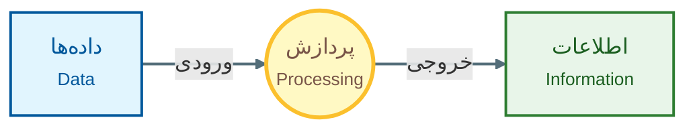

این مدل یکی از مهم‌ترین مدل‌های پایه در علوم کامپیوتر است:

```
‏Input → Processing → Output
```

یعنی:

1. چیزی وارد سیستم می‌شود.
2. سیستم روی آن عملیاتی انجام می‌دهد.
3. نتیجه تولید می‌شود.

برای مثال، فرض کنید می‌خواهیم مجموع دو عدد را محاسبه کنیم.

- **ورودی:** دو عدد ۱۰ و ۲۰
    
- **پردازش:** جمع کردن دو عدد
    
- **خروجی:** عدد ۳۰
    

البته سیستم‌های واقعی بسیار پیچیده‌تر از این مثال هستند و ممکن است در کنار ورودی، پردازش و خروجی، داده‌ها را ذخیره و دوباره بازیابی کنند.

---

## 3.1. داده (Data)

**داده** به مقادیر خامی گفته می‌شود که سیستم می‌تواند آن‌ها را دریافت، ذخیره یا پردازش کند. داده می‌تواند شکل‌های مختلفی مانند عدد، حرف، متن، تصویر، صدا، ویدئو یا اطلاعات حسگرها داشته باشند. برای مثال، عدد `25` به‌تنهایی می‌تواند فقط یک داده باشد. اگر بدانیم این عدد «دمای هوا بر حسب درجه‌ی سانتی‌گراد» است، معنای مشخص‌تری پیدا می‌کند.

---

## 3.۲. پردازش (Processing)

**پردازش** به عملیات‌هایی گفته می‌شود که روی داده‌ها انجام می‌شوند. این عملیات می‌توانند بسیار ساده باشند؛ مثلاً:

```text
‏10 + 20
```

یا بسیار پیچیده باشند؛ مثلاً پردازش میلیون‌ها تصویر برای آموزش یک مدل یادگیری ماشین. پردازش می‌تواند شامل مواردی مانند محاسبه، مقایسه، مرتب‌سازی، جست‌و‌جو، تبدیل، فیلتر کردن یا تحلیل داده باشد.

---

## 3.۳. اطلاعات (Information)

وقتی داده‌ها به شکلی پردازش شوند که **معنا و کاربرد مشخصی پیدا کنند**، می‌توان به آنها اطلاعات گفت. برای مثال:

```text
‏18, 20, 22, 24
```

اگر این اعداد دمای چهار روز متوالی باشند، محاسبه‌ی میانگین آن‌ها می‌تواند اطلاعات مفیدی تولید کند:

```text
میانگین دما = 21 درجه
```

بنابراین می‌توان گفت:

> داده، ماده‌ی خام است و پردازش روی داده می‌تواند اطلاعات معنادار تولید کند.

البته در مباحث پیشرفته‌تر علوم اطلاعات و داده، مرز دقیق میان «داده» و «اطلاعات» می‌تواند پیچیده‌تر باشد؛ اما این تعریف برای درک مبانی کامپیوتر مناسب است.

---

# 4. الگوریتم، برنامه و زبان برنامه‌سازی

سه اصطلاح **الگوریتم، برنامه و زبان برنامه‌سازی** از مهم‌ترین مفاهیم پایه‌ی برنامه‌نویسی هستند و نباید آن‌ها را با یکدیگر اشتباه گرفت.
## 4.۱. الگوریتم چیست؟

**الگوریتم (Algorithm)** مجموعه‌ای از دستورالعمل‌های دقیق و مرحله‌به‌مرحله برای حل یک مسئله یا انجام یک کار است. الگوریتم الزاماً با زبان برنامه‌نویسی نوشته نمی‌شود.

برای مثال، فرض کنید می‌خواهیم  دو عدد را پیدا کنیم.

می‌توان الگوریتم را به فارسی بنویسیم:

1. عدد اول را دریافت کن.    
2. عدد دوم را دریافت کن.
3. اگر عدد اول بزرگ‌تر از عدد دوم بود، عدد اول را نمایش بده.
4. در غیر این صورت، عدد دوم را نمایش بده.
5. پایان.

این یک الگوریتم است، حتی اگر هیچ خط کدی در آن وجود نداشته باشد.

### ویژگی مهم الگوریتم: پایان‌پذیری

یک الگوریتم باید برای رسیدن به نتیجه، بالاخره متوقف شود!
برای مثال:

```text
1. عدد را دریافت کن.
2. عدد را دو برابر کن.
3. نتیجه را نمایش بده.
4. پایان.
```

پایان مشخصی دارد.
اما دستور زیر یک الگوریتم کامل برای حل مسئله محسوب نمی‌شود:

```text
1. اعداد را بررسی کن.
2. بهترین عدد را پیدا کن.
3. دوباره بررسی کن.
4. دوباره بررسی کن.
...
```

زیرا مشخص نیست چه زمانی کار تمام می‌شود.

---

## 4.۲. الگوریتم فقط برای کامپیوتر نیست

یکی از سوءبرداشت‌های رایج این است که الگوریتم را چیزی مخصوص کامپیوتر بدانیم. در حقیقت، مفهوم الگوریتم بسیار عمومی‌تر است. برای مثال، دستور پخت یک غذا نیز می‌تواند نوعی دستورالعمل مرحله‌ای باشد:

1. مواد را آماده کن.
2. پیاز را خرد کن.
3. روغن را داغ کن.
4. پیاز را سرخ کن.
5. مواد بعدی را اضافه کن.
6. غذا را در بشقاب بریز.
7. پایان.

تفاوت اصلی این است که در برنامه‌نویسی، دستورالعمل‌ها باید برای کامپیوتر **به‌اندازه‌ی کافی دقیق و قابل‌اجرا** باشند. ما این پیش‌فرض را داریم که برای پخت غذا نیاز به روشن کردن اجاق داریم، اما برای کامپیوتر چنین مسئله ای مطرح نیست.

---

## 4.۳. برنامه‌ی کامپیوتری چیست؟

**برنامه (Program)** پیاده‌سازی یک الگوریتم با استفاده از یک زبان برنامه‌سازی است. برای مثال، الگوریتم قبلی می‌گفت:

> دو عدد را بگیر و مجموع آن‌ها را نمایش بده.

همین الگوریتم را می‌توان با زبان C به شکل زیر پیاده‌سازی کرد:

```c
#include <stdio.h>

int main(void) {
    int a = 10;
    int b = 20;

    int sum = a + b;

    printf("%d\n", sum);

    return 0;
}
```

در اینجا الگوریتم به دستورهایی تبدیل شده که یک زبان برنامه‌سازی مشخص آن‌ها را تعریف کرده است.

---

## 4.۴. زبان برنامه‌سازی چیست؟

**زبان برنامه‌سازی (Programming Language)** مجموعه‌ای از قواعد و دستورهایی است که به برنامه‌نویس اجازه می‌دهد الگوریتم‌ها را به شکلی قابل‌اجرا برای کامپیوتر بیان کند.

نمونه‌هایی از زبان‌های برنامه‌سازی عبارت‌اند از C, C++, JavaScript, Python و... . هر زبان قواعد خودش را دارد.

برای مثال، در زبان C می‌توان نوشت:

```c
‏int x = 10;
```

اما نمی‌توان دستورها را کاملاً دلخواه نوشت؛ زبان دارای **نحو (Syntax)** و قواعد مشخصی است.

به همین دلیل رابطه‌ی این سه مفهوم را می‌توان چنین خلاصه کرد:

```text
مسئله
‏  ↓
الگوریتم
‏  ↓
پیاده‌سازی الگوریتم
‏  ↓
برنامه
‏  ↓
زبان برنامه‌سازی
```


# 4.5. زبان‌های سطح پایین و سطح بالا

یکی از نکات مهم این فصل، تفاوت میان زبان‌های سطح پایین و سطح بالا است.

#### زبان سطح پایین
به سخت‌افزار نزدیک‌تر است. مثل Machine Language و Assembly.
#### زبان سطح بالا
جزئیات بیشتری از سخت‌افزار را از برنامه‌نویس پنهان می‌کند و نوشتن برنامه را ساده‌تر می‌سازد. مثل C و Python.


در یک نگاه ساده:

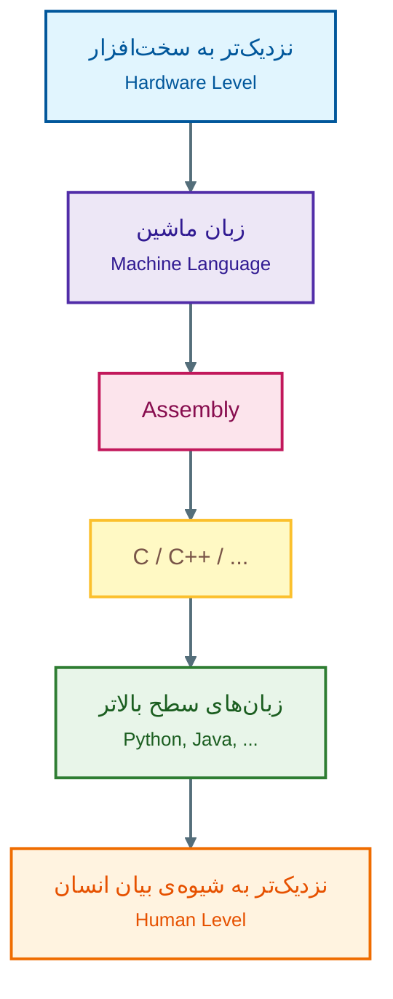

البته «سطح بالا» به معنای «کند» و «سطح پایین» به معنای «سریع» نیست. سرعت واقعی یک برنامه به عوامل بسیار بیشتری مانند زبان، کامپایلر، الگوریتم، سخت‌افزار و نحوه‌ی اجرای برنامه بستگی دارد.

مزیت اصلی زبان‌های سطح پایین، کنترل بیشتر و نزدیکی بیشتر به سخت‌افزار است؛ در مقابل، زبان‌های سطح بالا معمولاً بهره‌وری برنامه‌نویس و خوانایی بیشتری فراهم می‌کنند.

---

# 5. اجزای کامپیوتر: سخت‌افزار و نرم‌افزار

اکنون که درباره‌ی برنامه و زبان برنامه‌سازی صحبت کردیم، باید ببینیم برنامه در چه چیزی اجرا می‌شود.

هر سیستم کامپیوتری را می‌توان از دو بخش کلی بررسی کرد:

1. **سخت‌افزار (Hardware)**
2. **نرم‌افزار (Software)**

## 5.1. سخت‌افزار

**سخت‌افزار** به اجزای فیزیکی کامپیوتر گفته می‌شود؛ یعنی چیزهایی که از نظر فیزیکی وجود دارند و می‌توان آن‌ها را لمس کرد. مثل: CPU، RAM، SSD، مانیتور، ماوس و کیبورد.

## 5.2. نرم‌افزار

**نرم‌افزار** مجموعه‌ای از برنامه‌ها و دستورالعمل‌هایی است که به سخت‌افزار می‌گویند چه کاری انجام دهد. مثل: سیستم عامل، مرورگر وب و بازی.
بدون نرم‌افزار، سخت‌افزار یک سیستم قابل‌استفاده‌ی عمومی نخواهد بود؛ و نرم‌افزار نیز برای اجرا به سخت‌افزار نیاز دارد.

---

## 5.3. معماری کلی سخت‌افزار

برای درک نحوه‌ی کار یک کامپیوتر، می‌توان اجزای اصلی آن را به چند بخش تقسیم کرد:

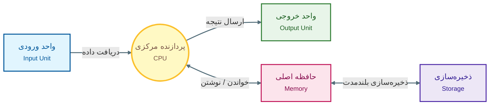

اجزای اصلی عبارت‌اند از:

- واحد ورودی
    
- واحد خروجی
    
- واحد پردازش مرکزی
    
- حافظه
    
- ذخیره‌سازی
    

---

## 5.4. واحد ورودی (Input Unit)

**واحد ورودی** وظیفه دارد داده‌ها و دستورهای موردنیاز سیستم را از محیط بیرون دریافت کند. نمونه‌های آن دوربین، اسکنر، صفحه‌نمایش لمسی، ماوس و کیبورد و میکروفون هستند. مثلاً وقتی کلید `A` را روی صفحه‌کلید فشار می‌دهید، یک رویداد ورودی ایجاد می‌شود و سیستم آن را دریافت و پردازش می‌کند.
ورودی فقط به معنی «نوشتن متن» نیست. یک تصویر دوربین، صدای میکروفون یا اطلاعات یک حسگر نیز می‌تواند ورودی سیستم باشد.

---

## 5.5. واحد خروجی (Output Unit)

واحد خروجی وظیفه دارد نتیجه‌ی پردازش را به شکلی قابل استفاده برای کاربر یا یک سیستم دیگر ارائه کند.
نمونه‌های آن مانیتور، پرینتر، هدفون و اسپیکر و پلاتر هستند.

برای مثال، وقتی یک برنامه عدد `42` را روی صفحه نمایش می‌دهد، داده‌ای که در داخل کامپیوتر پردازش شده، از طریق سیستم خروجی به شکل قابل مشاهده برای کاربر ارائه می‌شود.

---

## 5.6. واحد پردازش مرکزی (CPU)


‏**CPU (Central Processing Unit)** یا واحد پردازش مرکزی، یکی از مهم‌ترین اجزای سیستم کامپیوتری است. ‏CPU دستورهای برنامه را اجرا می‌کند و عملیات مختلف را روی داده‌ها انجام می‌دهد. می‌توان CPU را محل اصلی اجرای دستورهای برنامه دانست.
‏CPU از بخش‌های مختلفی تشکیل شده است که سه مورد مهم عبارت‌اند از:

<ul style="text-align: right;">
<li>ALU</li>
<li>CU</li>
<li>Registers</li>
</ul>
---

### 5.6.1. واحد محاسبه و منطق (ALU)

‏**ALU (Arithmetic Logic Unit)** واحد محاسبه و منطق است. این بخش عملیات ریاضی و منطقی مختلفی را انجام می‌دهد.
عملیات ریاضی می‌توانند شامل مواردی مانند:

```text
جمع
تفریق
ضرب
```

و عملیات منطقی می‌توانند شامل مواردی مانند:

```text
مقایسه
بررسی برابر بودن
بزرگ‌تر یا کوچک‌تر بودن
```

باشند.

مثلاً اگر برنامه بخواهد بررسی کند:

```text
10 > 5
```

یکی از بخش‌های پردازنده باید این مقایسه را انجام دهد.

---

### 5.6.2. واحد کنترل (CU)

‏**CU (Control Unit)** مسئول هماهنگ کردن عملیات مختلف پردازنده است. می‌توان آن را مانند بخشی در نظر گرفت که تعیین می‌کند کدام عملیات، در چه زمانی و روی چه داده‌ای انجام شود. برای مثال، اجرای یک دستور ممکن است به‌صورت ساده شامل این مراحل باشد:

1. دستور از حافظه دریافت شود.
2. دستور تفسیر شود.
3. داده‌ی موردنیاز آماده شود.
4. عملیات موردنظر انجام شود.
5. نتیجه ذخیره شود.

واحد کنترل در هماهنگ کردن این مراحل نقش مهمی دارد.

---

### 5.6.۳. ثبات‌ها (Registers)

‏**Register**ها حافظه‌های بسیار کوچک و بسیار سریع داخل پردازنده هستند. ‏CPU برای انجام عملیات مختلف به مکان‌هایی نیاز دارد که بتواند داده‌ها و نتایج موقت را در آن‌ها نگه دارد. برای مثال، هنگام انجام یک محاسبه، برخی مقادیر ممکن است برای مدت بسیار کوتاهی در رجیستر CPU قرار بگیرند. رجیستر معمولاً بسیار سریع‌تر از حافظه‌ی اصلی هستند، اما تعداد و ظرفیت آن‌ها بسیار محدود است.

---

### 5.6.4. سرعت پردازنده و هرتز

یکی از واحدهایی که در ارتباط با پردازنده می‌بینیم **هرتز (Hz)** است. یک هرتز یعنی یک چرخه در ثانیه. واحدهای رایج‌تر عبارت‌اند از:

‏MHz = مگاهرتز = میلیون هرتز
    
‏ GHz = گیگاهرتز = میلیارد هرتز 

برای مثال:

```text
‏3 GHz = 3,000,000,000 Hz
```

اما یک نکته‌ی بسیار مهم:

> **فرکانس CPU به‌تنهایی معیار کاملی برای مقایسه‌ی عملکرد دو پردازنده نیست.**

دو پردازنده با فرکانس یکسان ممکن است به دلیل تفاوت در معماری، تعداد هسته‌ها، حافظه‌ی Cache، طراحی داخلی و سایر عوامل، عملکرد متفاوتی داشته باشند. بنابراین نباید تصور کنیم که یک پردازنده 4 گیگاهرتزی همیشه از یک پردازنده 3 گیگاهرتزی بهتر است.

---

## 5.7. حافظه‌ی نهان (Cache)

بین CPU و حافظه‌ی اصلی، مفهومی به نام **Cache** اهمیت زیادی دارد. ‏Cache حافظه‌ای با ظرفیت نسبتاً کم اما سرعت بسیار بالا است که برای کاهش زمان دسترسی CPU به داده‌های موردنیاز استفاده می‌شود. فرض کنید CPU دائماً به یک داده‌ی خاص نیاز دارد. اگر مجبور باشد هر بار آن را از حافظه‌ی اصلی دریافت کند، زمان بیشتری صرف خواهد شد. اگر داده‌ی موردنظر در Cache موجود باشد، CPU می‌تواند آن را سریع‌تر دریافت کند.
به این ایده می‌توان به شکل ساده نگاه کرد:

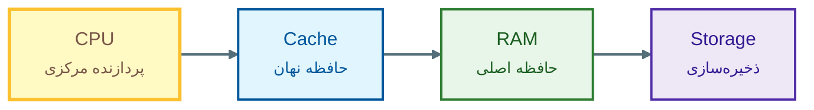

هرچه به CPU نزدیک‌تر می‌شویم، معمولاً ظرفیت کمتر و سرعت بیشتر می‌شود. در کامپیوترهای قدیمی‌تر، حافظهٔ **Cache** معمولاً یک قطعهٔ جدا از CPU بود و به‌صورت خارجی در کنار پردازنده قرار می‌گرفت. با پیشرفت فناوری، برای افزایش سرعت دسترسی به داده‌ها و کاهش تأخیر، حافظهٔ کش به داخل خود CPU منتقل شد. امروزه بیشتر پردازنده‌ها دارای چند سطح حافظهٔ کش داخلی مانند **L1، L2 و L3** هستند که مستقیماً در نزدیکی هسته‌های پردازشی قرار دارند.

---

## 5.8. حافظه (Memory) و انواع آن

کامپیوتر عموما نیاز دارد داده‌ها و دستورالعمل‌ها را نگهداری کند. حافظه‌ها را می‌توان به شکل‌های مختلفی دسته‌بندی کرد. در اینجا دو دسته‌ی مهم را بررسی می‌کنیم:

1. **حافظه‌ی اصلی (Main Memory)**
    
2. **حافظه‌ی جانبی یا ذخیره‌سازی ثانویه (Secondary Storage)**

تفاوت اساسی آن‌ها را می‌توان این‌گونه خلاصه کرد:

| ویژگی  | حافظه اصلی     | حافظه جانبی          |
| ------ | -------------- | -------------------- |
| سرعت   | بیشتر          | معمولاً کمتر         |
| ظرفیت  | محدودتر        | معمولاً بیشتر        |
| کاربرد | کار جاری سیستم | نگهداری بلندمدت داده |
| نمونه  | ‏RAM           | ‏SSD، HDD            |

---

### 5.8.1. حافظه‌ی اصلی (Main Memory)

حافظه‌ی اصلی حافظه‌ای است که سیستم برای نگهداری داده‌ها و دستورالعمل‌هایی که در حال استفاده هستند، از آن استفاده می‌کند. **یکی از مهم‌ترین انواع حافظه‌ی اصلی است.

---

### 5.8.2‏. RAM

**‏RAM (Random Access Memory)** حافظه‌ای است که سیستم‌عامل و برنامه‌های در حال اجرا از آن برای نگهداری داده‌ها و دستورالعمل‌های موردنیاز استفاده می‌کنند. برای مثال، وقتی یک برنامه را باز می‌کنید، بخش‌هایی از داده‌ها و کد موردنیاز آن باید در حافظه‌ی مناسب قرار بگیرند تا پردازنده بتواند با آن‌ها کار کند. فرض کنید یک برنامه‌ی سنگین را اجرا کرده‌اید و چند برنامه‌ی دیگر نیز هم‌زمان باز هستند. هرچه داده‌های موردنیاز برنامه‌ها بیشتر شود، سیستم به حافظه‌ی بیشتری نیاز دارد. اگر RAM کافی نباشد، سیستم ممکن است مجبور شود از روش‌های دیگری برای مدیریت داده‌های فعال استفاده کند که معمولاً عملکرد را کاهش می‌دهد. 
‏RAM معمولاً یک حافظه‌ی **فرّار (Volatile)** است. یعنی داده‌های موجود در آن با قطع برق پایدار نمی‌مانند. به همین دلیل، وقتی کامپیوتر را خاموش می‌کنید، اطلاعات موقتی موجود در RAM از بین می‌روند. مثلاً اگر فایلی را در Microsoft Word باز کرده باشید ولی هنوز آن را ذخیره نکرده باشید، اطلاعات آن ممکن است در حافظه‌ی موقت قرار داشته باشد و با خاموش شدن سیستم از دست برود.
عبارت Random Access به این معنی است که سیستم می‌تواند به مکان‌های مختلف حافظه با دسترسی مستقیم دسترسی پیدا کند و لازم نیست برای رسیدن به یک خانه، همه‌ی خانه‌های قبلی را به ترتیب طی کند. این مفهوم با «تصادفی بودن داده‌ها» اشتباه نشود.

---

### ‏5.8.3. ROM

‏**ROM (Read Only Memory)** نوعی حافظه‌ی غیر‌فرّار است؛ یعنی اطلاعات آن بدون برق نیز باقی می‌ماند. ‏ROM و فناوری‌های خانواده‌ی آن در سیستم‌های کامپیوتری برای نگهداری اطلاعاتی که باید پس از خاموش شدن دستگاه نیز باقی بمانند استفاده شده‌اند. در سیستم‌های مدرن، چیزی که در گفتار عمومی «ROM» نامیده می‌شود همیشه به معنای یک حافظه‌ی کاملاً غیرقابل‌تغییر نیست. انواع مختلفی از حافظه‌های غیر‌فرّار قابل برنامه‌ریزی یا بازنویسی وجود دارند.

---

### 5.8.4. حافظه‌ی جانبی و ذخیره‌سازی ثانویه

در کنار RAM، سیستم به نوعی حافظه نیاز دارد که اطلاعات را برای مدت طولانی نگهداری کند. مثل HDD, SSD, Flash Drive, Memory Card, CD, DVD.  این تجهیزات را معمولاً **Storage** یا ذخیره‌سازی می‌نامیم. مثلاً وقتی یک فایل Word را ذخیره می‌کنید، انتظار دارید پس از خاموش و روشن کردن کامپیوتر همچنان وجود داشته باشد. بنابراین فایل باید روی یک رسانه‌ی ذخیره‌سازی غیر‌فرّار قرار بگیرد، نه صرفاً در RAM.
حالا می‌دانیم وقتی که برنامه‌ی Word را باز می‌کنیم، فایل از فضای ذخیره‌سازی خوانده می‌شود، بخش‌های موردنیاز آن در RAM قرار می‌گیرند و CPU دستورهای برنامه را اجرا می‌کند.

---

# 6. واحدهای اندازه‌گیری داده

حالا با مفاهیم مربوط به حافظه آشنا شده‌ایم، اما باید بدانیم که داده ها چطور در حافظه ذخیره و نمایش داده می‌شوند.کامپیوترها داده‌ها را در سطح بنیادی با **بیت‌ها** نمایش می‌دهند.

## 6.۱. بیت (Bit)

‏**Bit** کوتاه‌شده‌ی Binary Digit است. هر بیت می‌تواند یکی از دو مقدار ``0`` و یا ``1`` را داشته باشد. دلیل استفاده از بیت این است که کامپیوترها در سطح سخت‌افزار با دو حالت ساده کار می‌کنند؛ مثل **روشن و خاموش بودن یک کلید الکتریکی**. بنابراین هر بیت می‌تواند فقط یکی از دو مقدار `0` یا `1` را نشان دهد. با کنار هم قرار گرفتن تعداد زیادی بیت، کامپیوتر می‌تواند اطلاعات پیچیده‌تر مانند اعداد، متن، تصویر و صدا را ذخیره و پردازش کند. این دو مقدار با مفهوم دودویی ارتباط دارند. بیت کوچک‌ترین واحد بنیادی اطلاعات دیجیتال در این مدل است.

---

## 6.۲. نیبل (Nibble)

هر **۴ بیت** یک نیبل را تشکیل می‌دهد:

```text
‏1010
```

بنابراین:

```text
‏1 Nibble = 4 Bits
```

---

## 6.۳. بایت (Byte)

هر **۸ بیت** برابر با یک بایت است:

```text
‏1 Byte = 8 Bits
```

برای مثال:

```text
‏10110101
```

یک بایت است.

بایت یکی از مهم‌ترین واحدهای اندازه‌گیری داده و ظرفیت ذخیره‌سازی است.


---

## 6.4. واحدهای بزرگ‌تر ذخیره‌سازی

حتما میدانید که برای بیان ظرفیت حافظه و ذخیره‌سازی، از واحدهایی مانند KB، MB، GB و TB استفاده می‌کنیم. در محاسبات دودویی سنتی:

```text
‏1 KB = 1024 Bytes
‏1 MB = 1024 KB
‏1 GB = 1024 MB
‏1 TB = 1024 GB
```

به صورت توان‌های ۲:

```text
‏1024 = 2¹⁰
```

بنابراین:

```text
‏1 KB = 2¹⁰ Bytes
‏1 MB = 2²⁰ Bytes
‏1 GB = 2³⁰ Bytes
‏1 TB = 2⁴⁰ Bytes
```

واحدهای بزرگ‌تر نیز عبارت‌اند از:

|واحد|نماد|رابطه‌ی دودویی سنتی|
|---|---|---|
|کیلوبایت|KB|1024 B|
|مگابایت|MB|1024 KB|
|گیگابایت|GB|1024 MB|
|ترابایت|TB|1024 GB|
|پتابایت|PB|1024 TB|
|اگزابایت|EB|1024 PB|
|زتابایت|ZB|1024 EB|
|یوتابایت|YB|1024 ZB|


---

# 7. ساختار داده‌ها در حافظه و سازمان‌دهی اطلاعات

تا اینجا با بیت و بایت آشنا شدیم. اما اگر بخواهیم یک سیستم اطلاعاتی بزرگ را مدیریت کنیم، نمی‌توانیم فقط با مجموعه‌ای عظیم از صفر و یک‌ها کار کنیم. برای انسان و نرم‌افزار، داده‌ها معمولاً در ساختارهای منطقی سازمان‌دهی می‌شوند.

یک مدل ساده‌ی سلسله‌مراتبی چنین است:

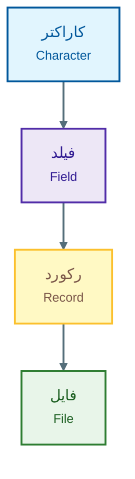

---

## 7.1. کاراکتر (Character)

‏**Character** می‌تواند یک حرف، رقم یا نماد باشد. برای مثال ``A`` , ``@`` , یا ``7``.کامپیوتر برای ذخیره‌ی کاراکترها از **کدهای عددی** استفاده می‌کند.
یعنی یک حرف مانند `A` در سطح ذخیره‌سازی به صورت خودِ مفهوم «حرف A» نگهداری نمی‌شود؛ بلکه با یک نمایش عددی/بیتی مشخص ذخیره می‌شود.

---

### 7.1.۲. ASCII

یکی از استانداردهای معروف برای نمایش کاراکترها **ASCII** است. ‏ASCII کلاسیک از ۷ بیت برای نمایش ۱۲۸ کاراکتر استفاده می‌کند و مقادیر ۰ تا ۱۲۷ را شامل می‌شود. برای مثال:

```text
‏A → 65
‏B → 66
‏C → 67
```

و برخی کاراکترهای دیگر نیز کدهای مخصوص خود را دارند. 

---

## 7.2. فیلد (Field)

**‏Field** مجموعه‌ای از داده است که یک ویژگی مشخص را بیان می‌کند. فرض کنید اطلاعات یک دانشجو را باید ذخیره کنیم:

```text
نام: مریم
نام خانوادگی: احمدی
سن: 22
```

در اینجا:

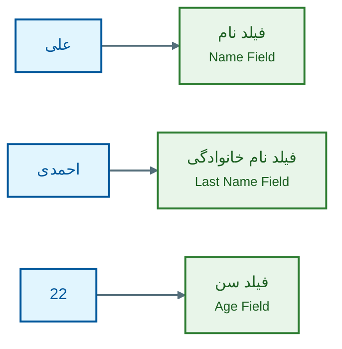

پس هر فیلد یک نوع اطلاعات مشخص را نگهداری می‌کند.

---

## 7.3. رکورد (Record)

‏**Record** مجموعه‌ای از فیلدهای مرتبط است که در کنار هم اطلاعات یک موجودیت مشخص را تشکیل می‌دهند.
مثلاً یک رکورد دانشجو می‌تواند شامل موارد زیر باشد:

```text
شماره دانشجویی
نام
نام خانوادگی
رشته
سال تولد
```

در واقع:

```text
رکورد دانشجو
├── شماره دانشجویی
├── نام
├── نام خانوادگی
├── رشته
└── سال تولد
```

---

## 7.4. فایل (File)

‏**File** مجموعه‌ای از داده‌ها یا رکوردهای مرتبط است که به‌صورت یک واحد ذخیره می‌شود. برای مثال، اگر یک دانشگاه اطلاعات ۱۰ هزار دانشجو را ذخیره کند، می‌توان تصور کرد که مجموعه‌ای از رکوردهای دانشجویان در یک ساختار داده‌ای یا فایل ذخیره شده است.  
البته در سیستم‌های مدرن، پایگاه‌های داده و سیستم‌های فایل بسیار پیچیده‌تر از این مدل ساده هستند، اما این سلسله‌مراتب برای درک اولیه‌ی سازمان‌دهی داده‌ها مفید است.

---

# 8. نرم‌افزار (Software)

تا اینجا بیشتر درباره‌ی سخت‌افزار صحبت کردیم. اما سخت‌افزار به‌تنهایی نمی‌تواند نیازهای کاربر را برآورده کند. برای مثال، CPU، RAM و SSD خودشان نمی‌دانند که کاربر می‌خواهد یک فایل متنی برای پایان‌نامه اش ایجاد کند، موسیقی موردعلاقه‌اش را پخش کند یا بازی Minesweeper را اجرا کند! این وظیفه بر عهده‌ی **نرم‌افزار** است. نرم‌افزار را می‌توان به چند گروه کلی تقسیم کرد

## 8.1. نرم‌افزارهای کاربردی (Application Software)

نرم‌افزارهای کاربردی برای انجام کارهایی طراحی می‌شوند که مستقیماً با نیاز کاربر نهایی ارتباط دارند. مثل نرم‌افزار های ویرایش متن (Microsoft Word) ، مرورگر های وب (Google Chrome)، نرم‌افزار های ویرایش تصویر (Adobe Photoshop)، بازی ها (Grand Theft Auto IV).


---

## 8.2. نرم‌افزارهای سیستمی (System Software)

نرم‌افزارهای سیستمی وظیفه دارند بستر لازم برای اجرای برنامه‌ها و مدیریت منابع سیستم را فراهم کنند. مهم‌ترین دسته‌های موردنظر در این درس عبارت‌اند از:

1. **سیستم‌عامل (Operating System)**  
    نرم‌افزاری است که بین کاربر و سخت‌افزار ارتباط برقرار می‌کند و منابع سیستم مانند پردازنده، حافظه و فایل‌ها را مدیریت می‌کند.  
    **مثال:** Windows، Linux، macOS، Android
2. **برنامه‌های کمکی (Utility Programs)**  
    برنامه‌هایی هستند که برای نگهداری، مدیریت و بهینه‌سازی سیستم استفاده می‌شوند.  
    **مثال:** آنتی‌ویروس‌ها، برنامه‌های فشرده‌سازی مانند WinRAR، ابزار پاک‌سازی دیسک (Disk Cleanup)
3. **مترجم‌ها (Language Translators)**  
    برنامه‌هایی هستند که کد نوشته‌شده توسط برنامه‌نویس را به زبان قابل فهم برای کامپیوتر تبدیل می‌کنند.  
    **مثال:** کامپایلر زبان C مانند GCC، مفسر Python، یا ماشین مجازی Java (JVM)

---

### 8.2.3. سیستم‌عامل (Operating System)

**سیستم‌عامل (OS)** یکی از مهم‌ترین نرم‌افزارهای یک کامپیوتر است. سیستم‌عامل بین سخت‌افزار، برنامه‌ها و کاربر نقش واسط دارد. برای مثال، یک برنامه‌ی کاربردی لازم نیست برای ذخیره‌ی یک فایل، مستقیماً دستورهای سخت‌افزاری پیچیده‌ای به SSD ارسال کند. برنامه می‌تواند از خدمات سیستم‌عامل استفاده کند و سیستم‌عامل عملیات لازم را مدیریت کند. ‏Microsoft Windows, MacOS, Android, و Linux از نمونه های سیستم‌عامل های معروف هستند.

می‌توان این رابطه را چنین نشان داد:

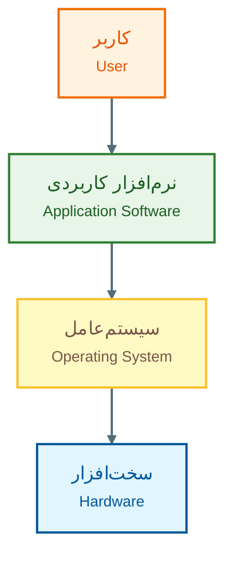

سیستم‌عامل مسئولیت‌های بسیار زیادی دارد، از جمله:

- مدیریت پردازنده
- مدیریت حافظه
- مدیریت فایل‌ها
- مدیریت دستگاه‌های ورودی و خروجی
- مدیریت اجرای برنامه‌ها
- کنترل دسترسی به منابع

به همین دلیل سیستم‌عامل یکی از مهم‌ترین اجزای نرم‌افزاری سیستم است. تصور کنید سیستم‌عامل وجود نداشت و هر برنامه باید مستقیماً با سخت‌افزار ارتباط برقرار می‌کرد. در چنین شرایطی برنامه‌نویس باید جزئیات بسیار زیادی درباره‌ی سخت‌افزار بداند و برنامه‌ی خود را برای کنترل مستقیم آن بنویسد. سیستم‌عامل این پیچیدگی را تا حد زیادی پنهان می‌کند. برای مثال، وقتی در یک برنامه فایلی را باز می‌کنید، معمولاً لازم نیست بدانید فایل دقیقاً در کدام سکتور یا سلول فیزیکی SSD قرار دارد. سیستم‌عامل است که این جزئیات را مدیریت می‌کند.
یک نکته‌ی کاربردی درباره‌ی سیستم‌عامل این است که **حذف یک برنامه یا پوشه‌ی مربوط به یک برنامه، الزاماً معادل حذف کامل آن برنامه نیست.** ممکن است فایل‌ها و تنظیمات برنامه در پوشه‌ها و رجیستری های مختلف سیستم‌عامل باقی بماند و Uninstall کردن یک برنامه آن را کامل از سیستم حذف نمی‌کند!

---

## 8.3. برنامه‌های کمکی (Utilities)

‏**Utility**ها برنامه‌هایی هستند که برای نگهداری، مدیریت، بررسی یا بهینه‌سازی سیستم استفاده می‌شوند.
نمونه‌ها می‌توانند شامل ابزارهایی برای:

- مدیریت دیسک    
- پشتیبان‌گیری
- فشرده‌سازی فایل‌ها
- بررسی سیستم
- امنیت
- مدیریت فایل

باشند.

برای مثال، یک ابزار مدیریت دیسک می‌تواند اطلاعات مربوط به پارتیشن‌ها و فضای ذخیره‌سازی را نمایش دهد.

---

## 8.4. مترجم‌ها (Translators)

تا اینجا گفتیم که برنامه‌نویس معمولاً برنامه را با یک زبان سطح بالا می‌نویسد. اما پردازنده در نهایت باید دستورهایی را اجرا کند که با معماری و دستورهای ماشین آن سازگار باشند. بنابراین میان **کدی که انسان می‌نویسد** و **دستورهایی که پردازنده اجرا می‌کند** به یک فرایند تبدیل یا ترجمه نیاز داریم.
دو مفهوم مهم در این زمینه عبارت‌اند از:

‏- Compiler
    
‏- Interpreter

---

### 8.4.1. کامپایلر (Compiler)

‏**Compiler** برنامه‌ای است که کد یک زبان برنامه‌سازی را به شکل دیگری تبدیل می‌کند تا بتوان آن را اجرا کرد. در مدل کلاسیک، کامپایلر برنامه‌ی منبع را بررسی کرده و آن را به کد ماشین یا یک شکل میانی قابل اجرا تبدیل می‌کند.

برای مثال:

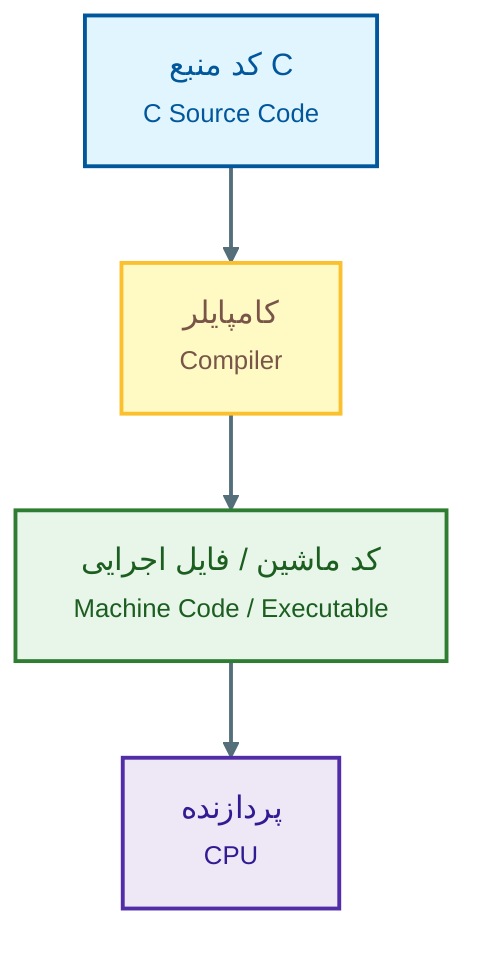

یکی از مزایای مدل کامپایل‌شده این است که پس از انجام فرایند ترجمه، نتیجه‌ی ترجمه‌شده می‌تواند برای اجرا مورد استفاده قرار گیرد. البته جزئیات واقعی بسیار پیچیده‌تر هستند. در بسیاری از سیستم‌ها مراحل مختلفی مانند preprocessing، compilation، assembly و linking وجود دارد.

---

### 8.4.2. مفسر (Interpreter)

در مدل سنتی **Interpreter**، برنامه هنگام اجرا توسط یک نرم‌افزار مفسر بررسی و اجرا می‌شود.


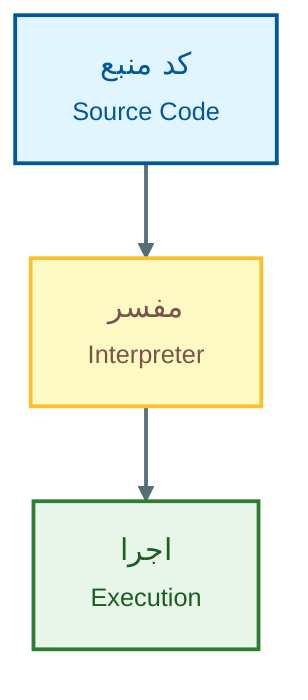

این مدل در زبان‌ها و محیط‌های مختلف شکل‌های متفاوتی دارد و نباید آن را صرفاً «خط اول را ترجمه کن، اجرا کن، سپس خط دوم را ترجمه کن» در نظر گرفت. برای مثال، برخی زبان‌های مدرن از ماشین مجازی، bytecode، JIT compilation یا ترکیبی از روش‌های تفسیر و کامپایل استفاده می‌کنند. بنابراین تفاوت Compiler و Interpreter در دنیای واقعی کاملاً به این سادگی نیست که یکی «کل برنامه» و دیگری همیشه «خط‌به‌خط» کار کند؛ این توضیح بیشتر یک مدل مقدماتی برای درک تفاوت آن‌هاست.

---

### 8.4.3. مقایسه‌ی Compiler و Interpreter

| ویژگی            | ‏Compiler                              | ‏Interpreter                                            |
| ---------------- | -------------------------------------- | ------------------------------------------------------- |
| ایده‌ی اصلی      | تبدیل برنامه پیش از اجرا               | پردازش و اجرای برنامه در محیط اجرا                      |
| خروجی ترجمه‌شده  | معمولاً تولید می‌شود                   | لزوماً به شکل فایل اجرایی مستقل تولید نمی‌شود           |
| تشخیص برخی خطاها | می‌تواند پیش از اجرا انجام شود         | ممکن است برخی خطاها هنگام رسیدن به بخش مربوطه مشخص شوند |
| مدل اجرا         | معمولاً برنامه‌ی ترجمه‌شده اجرا می‌شود | محیط اجرا در اجرای برنامه نقش دارد                      |

در عمل، زبان‌ها و محیط‌های مدرن ممکن است از ترکیبی از این روش‌ها استفاده کنند.

---

# 9. میان‌افزار (Firmware)

‏**Firmware** نوعی نرم‌افزار است که به‌صورت نزدیک و مستقیم با سخت‌افزار یک دستگاه ارتباط دارد و وظیفه‌ی کنترل یا راه‌اندازی آن را بر عهده می‌گیرد. می‌توان Firmware را در نقطه‌ای میان سخت‌افزار و نرم‌افزارهای سطح بالاتر تصور کرد. برای مثال، یک دستگاه الکترونیکی ممکن است Firmware مخصوص خود را داشته باشد که وظیفه‌ی کنترل اولیه‌ی سخت‌افزار را انجام می‌دهد.

نمونه‌های آشنا:

- ‏Firmware یک روتر
- ‏Firmware یک SSD
- ‏Firmware یک مادربرد
- ‏Firmware یک دستگاه IoT

‏Firmware معمولاً در حافظه‌ی **غیر‌فرّار** ذخیره می‌شود تا پس از خاموش شدن دستگاه باقی بماند. در سیستم‌های مدرن، Firmware لزوماً در ROM سنتی ذخیره نمی‌شود و می‌تواند در حافظه‌هایی مانند Flash قرار داشته باشد.

---

# 10. نگاه کلی به کل سیستم

اکنون می‌توانیم مفاهیم اصلی این فصل را در یک تصویر کلی کنار هم قرار دهیم:

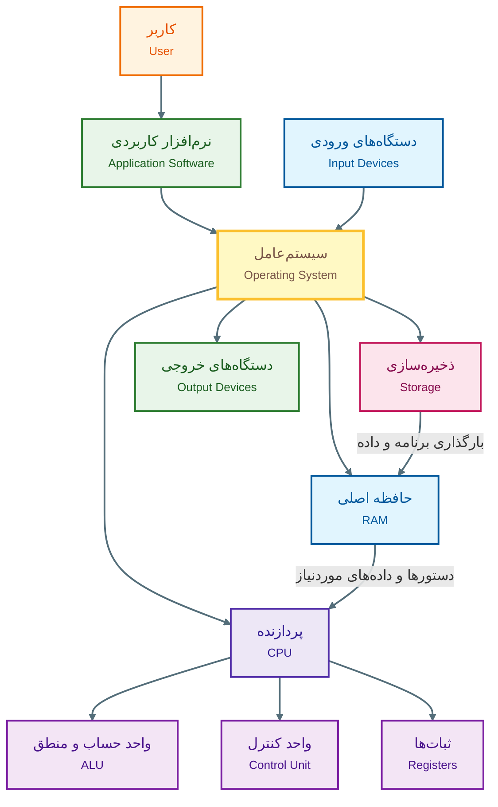

این نمودار یک مدل ساده‌شده است، اما چند ارتباط مهم را نشان می‌دهد:

1. کاربر معمولاً با نرم‌افزارهای کاربردی کار می‌کند.
    
2. نرم‌افزار کاربردی برای استفاده از منابع سیستم به سیستم‌عامل متکی است.
    
3. سیستم‌عامل منابعی مانند CPU، RAM و ذخیره‌سازی را مدیریت می‌کند.
    
4. ‏CPU دستورهای برنامه را اجرا می‌کند.
    
5. ‏RAM داده‌ها و دستورالعمل‌های موردنیاز در حال اجرا را نگهداری می‌کند.
    
6. ‏Storage داده‌ها را برای نگهداری بلندمدت حفظ می‌کند.
    
7. دستگاه‌های ورودی اطلاعات را وارد سیستم می‌کنند.
    
8. دستگاه‌های خروجی نتایج را به کاربر یا محیط بیرون ارائه می‌دهند.
    

---

## 10.1. یک مثال کامل: اجرای یک برنامه

برای اینکه ارتباط مفاهیم این فصل روشن‌تر شود، فرض کنید برنامه‌ای داریم که دو عدد را از کاربر می‌گیرد و مجموع آن‌ها را نمایش می‌دهد.
برنامه از کاربر ورودی دریافت می‌کند:

```text
عدد اول: 10
عدد دوم: 20
```

سپس عملیات جمع انجام می‌شود:

```text
‏10 + 20 = 30
```

و در نهایت نتیجه نمایش داده می‌شود:

```text
مجموع = 30
```

حالا این فرایند را از دید سیستم بررسی کنیم.

##### مرحله‌ی اول: ورودی
کاربر اعداد را با صفحه‌کلید وارد می‌کند. صفحه‌کلید یک **دستگاه ورودی** است.
##### مرحله‌ی دوم: برنامه
برنامه دستورهایی دارد که مشخص می‌کنند:

1. ورودی را دریافت کن.
2. مقدارها را نگهداری کن.
3. آن‌ها را جمع کن.
4. نتیجه را نمایش بده.

این دستورها در یک **زبان برنامه‌سازی** نوشته شده‌اند.

##### مرحله‌ی سوم: اجرای برنامه
برای اجرای برنامه، کد باید به شکلی درآید که محیط اجرا و در نهایت پردازنده بتواند آن را اجرا کند.
##### مرحله‌ی چهارم: حافظه
داده‌ها و بخش‌های موردنیاز برنامه در حافظه قرار می‌گیرند.
##### مرحله‌ی پنجم: CPU
‏CPU دستورها را اجرا می‌کند و عملیات محاسباتی لازم انجام می‌شود.
‏ALU در انجام عملیات محاسباتی نقش دارد و واحد کنترل اجرای مراحل مختلف را هماهنگ می‌کند.
##### مرحله‌ی ششم: خروجی
نتیجه‌ی `30` از طریق سیستم خروجی، مثلاً مانیتور، به کاربر نمایش داده می‌شود.

پس حتی یک برنامه‌ی بسیار ساده نیز مجموعه‌ای از مفاهیم این فصل را درگیر می‌کند!

---
# 11. جمع‌بندی فصل

در این فصل با مفاهیم پایه‌ای آشنا شدیم که تقریباً تمام مباحث بعدی علوم کامپیوتر بر آن‌ها بنا می‌شوند. ابتدا دیدیم که کامپیوتر یک سیستم قابل‌برنامه‌ریزی است که داده را دریافت و پردازش می‌کند و نتیجه تولید می‌کند. سپس تاریخچه‌ی کلی نسل‌های کامپیوتر را بررسی کردیم و دیدیم که فناوری‌هایی مانند **لامپ خلأ، ترانزیستور، مدار مجتمع و ریزپردازنده** چگونه باعث کوچک‌تر، سریع‌تر و ارزان‌تر شدن سیستم‌های کامپیوتری شدند.
بعد با مفاهیم بنیادی زیر آشنا شدیم:
- داده
- پردازش
- اطلاعات
- الگوریتم
- برنامه
- زبان برنامه‌سازی
- سخت‌افزار
- نرم‌افزار

سپس درباره‌ی تفاوت زبان‌های سطح پایین و سطح بالا صحبت کردیم و در بخش سخت‌افزار، اجزای مهم سیستم را بررسی کردیم (Input, CPU, Memory, Storage, Output). در بخش مربوط به CPU با مفاهیم ALU و CU و همچنین رجیستر‌ها آشنا شدیم در ادامه تفاوت میان انواع حافظه را مرور کردیم (RAM, ROM, Storage) و  همچنین واحدهای اندازه‌گیری داده را شناختیم. در نهایت، با ساختار ساده‌ی سازمان‌دهی داده‌ها آشنا شدیم و بخش نرم‌افزار را با معرفی انواع آن (کاربردی، سیستم عامل) به پایان رساندیم.

اگر بخواهیم تمام فصل را در یک مدل ذهنی خلاصه کنیم، می‌توانیم بگوییم:

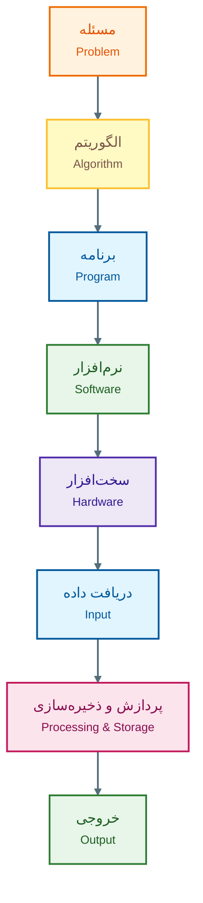

این مدل ذهنی پایه‌ای است که در فصل‌های بعدی، هنگام ورود به الگوریتم‌ها، فلوچارت، متغیرها، عملگرها، شرط‌ها، حلقه‌ها، آرایه‌ها و برنامه‌نویسی، مرتب به آن برمی‌گردیم.
