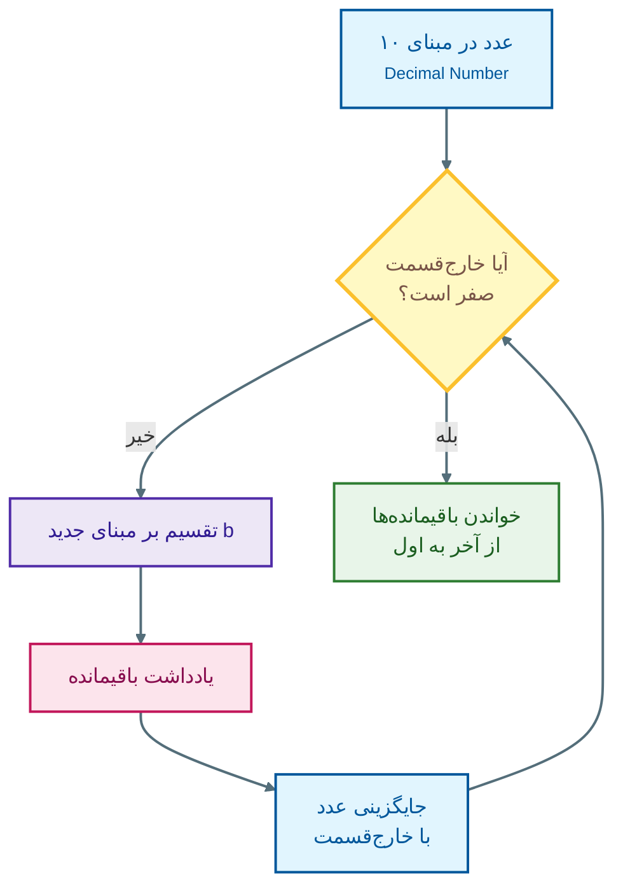

# فصل دوم: سیستم‌های عددی و نمایش داده‌ها در کامپیوتر

## ۱. مقدمه

ما در زندگی روزمره تقریباً همیشه از **سیستم عددی ده‌دهی (Decimal)** استفاده می‌کنیم. از دوران کودکی یاد می‌گیریم که برای شمارش از ده رقم `0` تا `9` استفاده کنیم و با مفاهیمی مانند یکان، دهگان، صدگان و هزارگان آشنا می‌شویم. برای مثال، وقتی عدد `98065` را می‌بینیم، می‌دانیم که رقم `5` در جایگاه یکان، `6` در جایگاه دهگان، `0` در جایگاه صدگان، `8` در جایگاه هزارگان و `9` در جایگاه ده‌هزارگان قرار دارد. اما این موضوع به خودی خود یک ویژگی ریاضیاتی مهم‌تر را نشان می‌دهد: **ارزش هر رقم به جایگاه آن وابسته است.**
در سیستم ده‌دهی، ارزش جایگاه‌ها بر اساس توان‌های عدد `10` تعیین می‌شود:
$$98065=(9\times10^4)+(8\times10^3)+(0\times10^2)+(6\times10^1)+(5\times10^0)$$
بنابراین:

$$98065=90000+8000+0+60+5$$

در اینجا عدد `10` را **مبنای سیستم عددی** می‌نامیم.

سیستم‌های عددی فقط به مبنای ۱۰ محدود نیستند. در علوم کامپیوتر، مبناهای دیگری مانند **۲، ۸ و ۱۶** اهمیت بسیار زیادی دارند؛ زیرا کامپیوتر در سطح سخت‌افزار با مقادیر دودویی، یعنی صفر و یک، کار می‌کند.

---

# ۲. مفهوم مبنا در سیستم‌های عددی

یک سیستم عددی با مبنای $b$ از تعدادی رقم مشخص برای نمایش اعداد استفاده می‌کند.در یک سیستم با مبنای $b$ رقم‌های مجاز عبارت‌اند از:

‏$0,1,2,\ldots,b-1$

بنابراین:

- در مبنای ۱۰، ده رقم `0` تا `9` داریم.
- در مبنای ۲، دو رقم `0` و `1` داریم.
- در مبنای ۸، هشت رقم `0` تا `7` داریم.
- در مبنای ۱۶، شانزده نماد از `0` تا `9` و سپس `A` تا `F` داریم.
- 
نکته مهم این است که **رقمی که از مبنای سیستم بزرگ‌تر یا مساوی با مبنا باشد، در آن سیستم مجاز نیست.** برای مثال، در مبنای ۷ فقط این رقم‌ها مجاز هستند:

$\{0,1,2,3,4,5,6\}$

بنابراین عددی مانند $(526)_7$ معتبر است، اما $(527)_7$ معتبر نیست؛ زیرا رقم $7$ در مبنای $7$ وجود ندارد. برای مشخص‌کردن مبنای یک عدد، **عددِ مبنا را به‌صورت زیرنویس در سمت راستِ عدد** می‌نویسیم؛ مانند $(526)_7$.

---

## ۲.۱. ارزش مکانی در هر مبنا

همان‌طور که در سیستم ده‌دهی جایگاه‌های عدد بر اساس توان‌های ۱۰ تعیین می‌شوند، در یک سیستم با مبنای $b$، جایگاه‌ها بر اساس توان‌های $b$ تعیین می‌شوند. برای مثال، عدد زیر را در مبنای ۷ در نظر بگیرید:

$(2421)_7$

از سمت راست، توان‌های مبنا از صفر شروع می‌شوند:

| رقم | جایگاه | ارزش مکانی |
| --- | ------ | ---------- |
| 1   | $7^0$  | 1          |
| 2   | $7^1$  | 7          |
| 4   | $7^2$  | 49         |
| 2   | $7^3$  | 343        |

بنابراین:
$$(2421)_7=2(7^3)+4(7^2)+2(7^1)+1(7^0)$$

یعنی:
$$=2(343)+4(49)+2(7)+1$$

پس مفهوم اصلی سیستم‌های عددی بسیار ساده است:

> **هر رقم در یک جایگاه مشخص قرار دارد و ارزش آن جایگاه با توان‌های مبنا تعیین می‌شود.**

این اصل تقریباً تمام تبدیل‌های مبنا را توضیح می‌دهد.

---

# ۳. تبدیل بین سیستم‌های عددی

در برنامه‌نویسی و علوم کامپیوتر، لازم است بتوانیم یک عدد را از یک مبنا به مبنای دیگر تبدیل کنیم. دو تبدیل پایه عبارت‌اند از:

1. تبدیل از مبنای ۱۰ به مبنای دیگر
2. تبدیل از یک مبنای دیگر به مبنای ۱۰

سپس می‌توانیم از رابطه میان مبناهای ۲، ۸ و ۱۶ برای تبدیل سریع‌تر استفاده کنیم.

---

# ۳.۱. تبدیل از مبنای ۱۰ به مبنای دلخواه

برای تبدیل یک عدد صحیح از مبنای ۱۰ به مبنای $b$، از روش **تقسیمات متوالی** استفاده می‌کنیم.

مراحل کار عبارت‌اند از:

1. عدد را بر مبنای جدید $b$ تقسیم می‌کنیم.
    
2. باقیمانده تقسیم را یادداشت می‌کنیم.
    
3. خارج‌قسمت را دوباره بر $b$ تقسیم می‌کنیم.
    
4. این کار را تا زمانی ادامه می‌دهیم که خارج‌قسمت صفر شود.
    
5. در پایان، باقیمانده‌ها را **از آخر به اول** می‌خوانیم.
    

دلیل خواندن معکوس باقیمانده‌ها این است که اولین تقسیم، رقم مربوط به کم‌ارزش‌ترین جایگاه را به دست می‌دهد و آخرین تقسیم، رقم مربوط به پرارزش‌ترین جایگاه را مشخص می‌کند.

#### الگوریتم



---

## مثال: تبدیل $897_{10}$ به مبنای ۷

عدد `897` را به صورت متوالی بر `7` تقسیم می‌کنیم:


$$
\begin{array}{r|r|r}
897 & \div 7 & =128\quad \text{remainder }1\\
128 & \div 7 & =18\quad \text{remainder }2\\
18 & \div 7 & =2\quad \text{remainder }4\\
2 & \div 7 & =0\quad \text{remainder }2
\end{array}
$$

باقیمانده‌ها از بالا به پایین عبارت‌اند از:
`2, 4, 2, 1`

اما باید آن‌ها را **از پایین به بالا** بخوانیم:
`1, 2, 4, 2` 

بنابراین:

$897_{10}=(2421)_7$

### چرا اولین باقیمانده سمت راست عدد است؟

به رابطه زیر توجه کنید:

‏$897=7×128+1897 = 7\times128 + 1$

این `1` در واقع همان رقم مربوط به $707^0$ است؛ یعنی کم‌ارزش‌ترین رقم.

سپس:

$‏128=7×18+2128=7\times18+2$

رقم بعدی `2` مربوط به $717^1$ است.

به همین ترتیب، هر تقسیم یکی از جایگاه‌های عدد را از سمت راست به سمت چپ مشخص می‌کند. به همین دلیل ترتیب نهایی باقیمانده‌ها معکوس می‌شود.

---

# ۳.۲. تبدیل از مبنای دلخواه به مبنای ۱۰

تبدیل در جهت مخالف ساده‌تر است. برای تبدیل یک عدد از مبنای $b$ به ده‌دهی، کافی است:

1. هر رقم را در توان مناسب مبنا ضرب کنیم.
    
2. تمام حاصل‌ها را با یکدیگر جمع کنیم.
    

برای مثال:

$(2421)_7$

دارای چهار رقم است. بنابراین از سمت راست، توان‌های `0` تا `3` را داریم:

$$(2421)_7=2(7^3)+4(7^2)+2(7^1)+1(7^0)$$

حالا محاسبه می‌کنیم:
$$
=2(343)+4(49)+2(7)+1=686+196+14+1=897
$$

پس:
$$(2421)_7=(897)_{10}$$

این نتیجه همچنین تبدیل قبلی ما را تأیید می‌کند.

### نکته مهم

در این روش، **شماره‌گذاری توان‌ها همیشه از سمت راست و از صفر شروع می‌شود.**

برای مثال:
‏$(5312)_b$

به شکل زیر تفسیر می‌شود:
$$5b^3+3b^2+1b^1+2b^0$$
نه اینکه اولین رقم را در $b^1$ ضرب کنیم.

---

# ۴. مبناهای مهم در علوم کامپیوتر

اگرچه می‌توان از هر مبنای دلخواهی استفاده کرد، سه مبنای **۲، ۸ و ۱۶** در علوم کامپیوتر اهمیت ویژه‌ای دارند. این سه مبنا به دلیل رابطه بسیار ساده‌ای که با سیستم دودویی دارند، در برنامه‌نویسی، معماری کامپیوتر، نمایش حافظه، مدارهای دیجیتال و بسیاری از حوزه‌های دیگر استفاده می‌شوند.

---

## ۴.۱. مبنای دو؛ Binary

سیستم دودویی یا **Binary** دارای مبنای ۲ است و فقط از دو رقم استفاده می‌کند:

$\{0,1\}$

همانطور که در فصل قبل خواندیم هر رقم دودویی را یک **بیت (Bit)** می‌نامیم. بنابراین یک بیت می‌تواند تنها یکی از ارقام ``0`` یا ``1`` باشد.
این ویژگی با نحوه کار بسیاری از مدارهای الکترونیکی کامپیوتر سازگار است. در سطح سخت‌افزار، وضعیت‌های مختلف مدار را می‌توان به شکل دو حالت منطقی نمایش داد و این دو حالت معمولاً با `0` و `1` نشان داده می‌شوند.
با کنار هم قرار گرفتن بیت‌ها می‌توانیم مقادیر بسیار بیشتری را نمایش دهیم.

برای مثال:

- ۱ بیت → ۲ حالت
- ۲ بیت → ۴ حالت
- ۳ بیت → ۸ حالت
- ۴ بیت → ۱۶ حالت
- ۸ بیت → ۲۵۶ حالت 
به طور کلی، با $n$ بیت می‌توان ‏$2^n$ حالت متفاوت را نمایش داد.
برای مثال، با ۸ بیت $2^8=256$ حالت مختلف داریم.

---

### مثال: تبدیل $486_{10}$ به مبنای ۲

عدد `486` را به صورت متوالی بر ۲ تقسیم می‌کنیم:

$$
\begin{array}{r|r|r}
486 & \div 2 & =243\quad \text{remainder }0\\
243 & \div 2 & =121\quad \text{remainder }1\\
121 & \div 2 & =60\quad \text{remainder }1\\
60 & \div 2 & =30\quad \text{remainder }0\\
30 & \div 2 & =15\quad \text{remainder }0\\
15 & \div 2 & =7\quad \text{remainder }1\\
7 & \div 2 & =3\quad \text{remainder }1\\
3 & \div 2 & =1\quad \text{remainder }1\\
1 & \div 2 & =0\quad \text{remainder }1
\end{array}
$$

باقیمانده‌ها را از پایین به بالا می‌خوانیم: ``111100110
``
بنابراین:
$$486_{10}=(111100110)_2$$

می‌توانیم برای اطمینان نتیجه را دوباره به ده‌دهی تبدیل کنیم:

$$
\begin{aligned}
(111100110)_2
&=1(2^8)+1(2^7)+1(2^6)+1(2^5)+0(2^4)\\
&\quad+0(2^3)+1(2^2)+1(2^1)+0(2^0)\\
&=256+128+64+32+4+2\\
&=486
\end{aligned}
$$
پس تبدیل درست است.

---

# ۴.۲. مبنای هشت؛ Octal

سیستم هشت‌هشتی یا **Octal** مبنای ۸ دارد و از هشت رقم زیر استفاده می‌کند:

$\{0,1,2,3,4,5,6,7\}$

رابطه مهم مبنای ۸ با مبنای ۲ از اینجا می‌آید:
$$8=2^3$$

به همین دلیل **هر رقم هشت‌هشتی دقیقاً معادل سه بیت دودویی است.**

برای مثال:

| Octal | Binary |
| ----: | -----: |
|     0 |    000 |
|     1 |    001 |
|     2 |    010 |
|     3 |    011 |
|     4 |    100 |
|     5 |    101 |
|     6 |    110 |
|     7 |    111 |

این رابطه باعث می‌شود تبدیل بین باینری و اکتال بسیار سریع باشد.

---

### تبدیل باینری به اکتال

برای تبدیل یک عدد صحیح دودویی به مبنای ۸:

1. از سمت راست شروع می‌کنیم.
    
2. بیت‌ها را سه‌تا سه‌تا گروه‌بندی می‌کنیم.
    
3. اگر گروه سمت چپ کمتر از سه بیت داشت، در سمت چپ آن صفر اضافه می‌کنیم.
    
4. هر گروه سه‌بیتی را به رقم اکتال تبدیل می‌کنیم.
    

### مثال

$(10011111)_2$

گروه‌بندی از سمت راست:

``10 | 011 | 111``

گروه اول فقط دو بیت دارد، بنابراین یک صفر در سمت چپ آن اضافه می‌کنیم:

``010 | 011 | 111``

حالا هر گروه را تبدیل می‌کنیم:

``010 ← 2``
``011 ← 3``
``111 ← 7``


پس:
$$(10011111)_2=(237)_8$$
### چرا گروه‌بندی از راست انجام می‌شود؟

زیرا رقم سمت راست در سیستم عددی کم‌ارزش‌ترین رقم است و هر رقم اکتال دقیقاً سه جایگاه دودویی را پوشش می‌دهد. بنابراین گروه‌بندی باید از سمت راست آغاز شود تا مرز جایگاه‌ها درست حفظ شود.

---

# ۴.۳. مبنای شانزده؛ Hexadecimal

سیستم شانزده‌شانزدهی یا **Hexadecimal** مبنای ۱۶ دارد. مشکل اینجاست که برای نمایش اعداد ۰ تا ۱۵ به ۱۶ نماد نیاز داریم، در حالی که فقط ده رقم `0` تا `9` در اختیار داریم. بنابراین برای شش مقدار باقی‌مانده از حروف انگلیسی استفاده می‌کنیم:

|ده‌دهی|هگزادسیمال|
|--:|:-:|
|0|0|
|1|1|
|2|2|
|3|3|
|4|4|
|5|5|
|6|6|
|7|7|
|8|8|
|9|9|
|10|A|
|11|B|
|12|C|
|13|D|
|14|E|
|15|F|


رابطه مهم هگزادسیمال با باینری نیز بسیار ساده است:
$$16=2^4$$
بنابراین **هر رقم هگزادسیمال دقیقاً معادل چهار بیت دودویی است.** این ویژگی باعث شده هگزادسیمال یکی از مهم‌ترین روش‌های خلاصه‌نویسی مقادیر دودویی باشد.

---

### تبدیل باینری به هگزادسیمال

برای تبدیل:

1. بیت‌ها را از سمت راست چهار تا چهار تا گروه‌بندی می‌کنیم.
    
2. اگر گروه سمت چپ کمتر از چهار بیت داشت، صفر اضافه می‌کنیم.
    
3. هر گروه را به یک رقم هگزادسیمال تبدیل می‌کنیم.
    

### مثال

عدد $(1010011101)_2$ را در نظر بگیرید.

گروه‌بندی:

``1101 | 1001 | 10``

گروه سمت چپ را با صفر کامل می‌کنیم:

``1101 | 1001 | 0010``

حالا:
‏``1101← 13← D``
``1001 ← 9``
``0010 ← 2``

پس:
$$(1010011101)_2=(29D)_{16}$$
---

# ۴.۴. تبدیل اکتال و هگزادسیمال به باینری

در جهت مخالف، کار حتی ساده‌تر است. برای تبدیل اکتال به باینری، هر رقم را با **سه بیت** جایگزین می‌کنیم. برای تبدیل هگزادسیمال به باینری، هر رقم را با **چهار بیت** جایگزین می‌کنیم.
### مثال: هگزادسیمال به باینری

عدد ‏$(BF3)_{16}$ را در نظر بگیرید.

از جدول بالا:


‏``B ← 1011``
‏``F ← 1111``
‏``0011 ← 3``

بنابراین:
$$(BF3)_{16}=(101111110011)_2$$

---

## مثال: اکتال به باینری

عدد:

$(367)_8$

را در نظر بگیرید:

``3 ← 011``
``6 ← 110``
``7 ← 111``

پس:

```text
011 | 110 | 111
```

و در نتیجه:
$$(367)_8=(011110111)_2$$
صفر ابتدایی را می‌توان در صورت نیاز حذف کرد:
$$(367)_8=(11110111)_2$$
هر دو نمایش از نظر مقدار عددی یکسان‌اند.

---

# ۵. تبدیل اعداد دارای بخش اعشاری

تا اینجا با اعداد صحیح کار کردیم. اما اعداد می‌توانند دارای بخش اعشاری نیز باشند، مانند: ``41.75``. در چنین حالتی، بخش صحیح و بخش اعشاری را **جداگانه** تبدیل می‌کنیم. برای بخش صحیح از تقسیمات متوالی استفاده می‌شود. اما برای بخش اعشاری، روش متفاوتی داریم: **ضرب‌های متوالی در مبنا**.

---

# ۵.۱. تبدیل بخش اعشاری از مبنای ۱۰ به مبنای ۲

برای تبدیل یک بخش اعشاری از ده‌دهی به باینری:

1. بخش اعشاری را در ۲ ضرب می‌کنیم.
    
2. بخش صحیح حاصل را استخراج می‌کنیم.
    
3. فقط بخش اعشاری باقی‌مانده را دوباره در ۲ ضرب می‌کنیم.
    
4. این کار را ادامه می‌دهیم.
    
5. ارقام صحیحی که در هر مرحله به دست آمده‌اند، از بالا به پایین بعد از ممیز قرار می‌گیرند.
    

### مثال: تبدیل $0.75_{10}$ به باینری

مرحله اول:
$$0.75\times2=1.5$$

بخش صحیح `1` است.

بخش اعشاری باقی‌مانده:

$0.5$

مرحله دوم:
$$0.5\times2=1.0$$

دوباره بخش صحیح `1` است.

چون بخش اعشاری اکنون صفر شده، کار تمام است.

بنابراین:

```text
0.75₁₀ = 0.11₂
```

---

##### مثال کامل: تبدیل $41.75_{10}$ به باینری

ابتدا بخش صحیح را تبدیل می‌کنیم:

$$41_{10}=101001_2$$

سپس بخش اعشاری:

$$0.75_{10}=0.11_2$$

دو قسمت را کنار هم قرار می‌دهیم:

$$(41.75)_{10}=(101001.11)_2$$2

---

## چرا روش ضرب استفاده می‌شود؟

در بخش صحیح، تقسیم‌های متوالی با مبنا باعث می‌شوند رقم‌ها را از سمت راست استخراج کنیم.

در بخش اعشاری، ضرب‌های متوالی در مبنا باعث می‌شوند رقم‌های بعد از ممیز را از سمت چپ استخراج کنیم.

بنابراین می‌توان این دو روش را به صورت زیر به خاطر سپرد:

> **قسمت صحیح → تقسیم متوالی**

> **قسمت اعشاری → ضرب متوالی**

---

## ۵.۲. تبدیل عدد اعشاری باینری به ده‌دهی

برای تبدیل عددی که دارای بخش اعشاری است از باینری به ده‌دهی، همان مفهوم ارزش مکانی را ادامه می‌دهیم. تفاوت این است که بعد از ممیز، توان‌های مبنا منفی می‌شوند:

$$2^{-1},2^{-2},2^{-3},\ldots$$

برای مثال:

$$(0.101)_2$$

را در نظر بگیرید.

رقم اول بعد از ممیز در $2^{-1}$، رقم دوم در $2^{-2}$ و رقم سوم در $2^{-3}$ قرار دارد:

$$(0.101)_2=1(2^{-1})+0(2^{-2})+1(2^{-3})$$

بنابراین:

$$
=1\left(\frac{1}{2}\right)+0\left(\frac{1}{4}\right)+1\left(\frac{1}{8}\right)
=0.5+0+0.125
=0.625
$$

پس:

$$(0.101)_2=(0.625)_{10}$$

---

# ۶. روش خط‌کش باینری

یکی دیگر از روش‌های ساده برای تبدیل یک عدد ده‌دهی به باینری، استفاده از **توان‌های ۲** است.

در این روش، توان‌های ۲ را از بزرگ به کوچک می‌نویسیم و بررسی می‌کنیم که هر توان آیا در عدد باقی‌مانده جا می‌شود یا خیر.

برای مثال، برای اعداد تا ۸ بیت می‌توان نوشت:

| $2^7$ | $2^6$ | $2^5$ | $2^4$ | $2^3$ | $2^2$ | $2^1$ | $2^0$ |
| ----: | ----: | ----: | ----: | ----: | ----: | ----: | ----: |
|   128 |    64 |    32 |    16 |     8 |     4 |     2 |     1 |

اگر یک مقدار در عدد موردنظر جا شود، `1` می‌نویسیم و آن مقدار را کم می‌کنیم.

اگر جا نشود، `0` می‌نویسیم.

---

## مثال: تبدیل ۱۳ به باینری

ببزرگ‌ترین توان ۲ که در ۱۳ جا می‌شود، `8` است:

$$13-8=5$$

پس برای $2^3$ رقم `1` داریم.

اکنون `4` در ۵ جا می‌شود:

$$5-4=1$$

پس برای $2^2$ نیز `1` داریم.

عدد `2` در ۱ جا نمی‌شود، پس برای $2^1$ رقم `0` داریم.

در نهایت `1` در ۱ جا می‌شود، پس برای $2^0$ رقم `1` داریم.

بنابراین:

| توان | $2^3$ | $2^2$ | $2^1$ | $2^0$ |
|---|---:|---:|---:|---:|
| مقدار | 8 | 4 | 2 | 1 |
| باینری | 1 | 1 | 0 | 1 |

پس:

$$(13)_{10}=(1101)_2$$

این روش درک خوبی از مفهوم باینری ایجاد می‌کند، زیرا به جای انجام تقسیمات متوالی، مستقیماً می‌بینیم که عدد از چه توان‌هایی از ۲ تشکیل شده است:

$$13=8+4+1$$

و به همین دلیل نمایش باینری آن `1101` است.

---

# ۷. اعداد اعشاری در مبناهای ۸ و ۱۶

رابطه بین باینری، اکتال و هگزادسیمال فقط برای اعداد صحیح نیست؛ برای اعداد دارای بخش اعشاری نیز برقرار است.

تفاوت اصلی در نحوه گروه‌بندی بخش بعد از ممیز است.

برای بخش صحیح، گروه‌بندی را از **راست به چپ** انجام می‌دهیم.

برای بخش اعشاری، گروه‌بندی را از **چپ به راست** انجام می‌دهیم.

---

## مثال: اکتال به باینری

عدد زیر را در نظر بگیرید:

$$(547.632)_8$$

برای بخش صحیح:

```text
5 → 101
4 → 100
7 → 111
```

برای بخش اعشاری نیز:

```text
6 → 110
3 → 011
2 → 010
```

بنابراین:

$$(547.632)_8=(101100111.110011010)_2$$

---

## مثال: هگزادسیمال به باینری

$$(F4E.8C)_{16}$$

هر رقم هگزادسیمال را به چهار بیت تبدیل می‌کنیم:

```text
F → 1111
4 → 0100
E → 1110

8 → 1000
C → 1100
```

در نتیجه:

$$(F4E.8C)_{16}=(111101001110.10001100)_2$$

---

## مثال: باینری به اکتال

$$(1011.1011)_2$$

بخش صحیح را از راست سه‌تا سه‌تا و بخش اعشاری را از چپ سه‌تا سه‌تا گروه‌بندی می‌کنیم:

```text
001 | 011 . 101 | 100
```

سپس:

```text
001 → 1
011 → 3
101 → 5
100 → 4
```

بنابراین:

$$(1011.1011)_2=(13.54)_8$$

---

## مثال: باینری به هگزادسیمال

$$(10111.10111)_2$$

گروه‌بندی چهار بیتی:

```text
0001 | 0111 . 1011 | 1000
```

بنابراین:

```text
0001 → 1
0111 → 7
1011 → B
1000 → 8
```

در نتیجه:

$$(10111.10111)_2=(17.B8)_{16}$$

### نکته مهم درباره صفرهای اضافه

صفرهایی که برای کامل کردن گروه‌ها در سمت چپ بخش صحیح یا سمت راست بخش اعشاری اضافه می‌کنیم، **مقدار عدد را تغییر نمی‌دهند**.

برای مثال:

```text
1011
```

و

```text
001011
```

از نظر مقدار برابرند.

همین‌طور:

```text
0.1011
```

و

```text
0.101100
```

از نظر مقدار برابرند.

این صفرها فقط برای کامل کردن گروه‌های سه‌بیتی یا چهار‌بیتی استفاده می‌شوند.

---

# ۸. چرا هگزادسیمال در کامپیوتر مهم است؟

ممکن است این سؤال مطرح شود که اگر کامپیوتر در نهایت با صفر و یک کار می‌کند، چرا اصلاً از اعداد هگزادسیمال استفاده می‌کنیم؟

پاسخ این است که نمایش رشته‌های طولانی باینری برای انسان بسیار دشوار است.

برای مثال:

```text
111111101010110011001101
```

خواندن و بررسی چنین رشته‌ای دشوار است و احتمال اشتباه نیز زیاد است.

اما چون هر رقم هگزادسیمال دقیقاً چهار بیت را نمایش می‌دهد، می‌توان همان مقدار را بسیار فشرده‌تر نوشت:

```text
FEACCD
```

این دو نمایش از نظر اطلاعاتی یکسان‌اند؛ فقط نمایش دوم برای انسان کوتاه‌تر و خواناتر است.

به همین دلیل هگزادسیمال در حوزه‌هایی مانند:

- نمایش آدرس‌های حافظه
    
- برنامه‌نویسی سطح پایین
    
- دیباگ کردن
    
- نمایش داده‌های خام
    
- معماری کامپیوتر
    
- نمایش رنگ‌ها در برخی محیط‌های نرم‌افزاری
    

زیاد دیده می‌شود.

---

# ۹. کدگذاری کاراکترها؛ ASCII

تا اینجا درباره نمایش اعداد صحبت کردیم. اما کامپیوتر فقط عدد ذخیره نمی‌کند. متن نیز باید به شکلی در حافظه ذخیره شود.

برای انسان، تفاوت میان این دو عبارت کاملاً واضح است:

```text
ABC
```

و

```text
123
```

اما سخت‌افزار در نهایت با الگوهایی از بیت‌ها کار می‌کند. بنابراین برای نمایش حروف و علائم باید یک روش استاندارد داشته باشیم که مشخص کند هر کاراکتر با چه عددی نمایش داده شود.

این کار را **کدگذاری کاراکتر (Character Encoding)** انجام می‌دهد.

---

# ۹.۱. ASCII چیست؟

یکی از استانداردهای تاریخی و بسیار مهم در این زمینه **ASCII** است:
**‏American Standard Code for Information Interchange**
‏ASCII در شکل اصلی خود از **۷ بیت** برای نمایش هر کاراکتر استفاده می‌کند. از آنجا که با ۷ بیت می‌توان $$2^7=128$$حالت مختلف ایجاد کرد، ASCII اصلی می‌تواند ۱۲۸ کد مختلف داشته باشد.

این کدها برای مواردی مانند حروف انگلیسی بزرگ و کوچک، ارقام `0` تا `9` ، علائم نگارشی، فاصله و برخی کاراکترهای کنترلی استفاده می‌شوند.

---

# ۹.۲. هر کاراکتر در واقع یک عدد است

برای مثال، حرف بزرگ: ``L`` در ASCII دارای مقدار ده‌دهی `76` است. بنابراین می‌توانیم مقدار آن را در مبناهای مختلف نمایش دهیم:

$$L=76_{10}$$
و:
$$76_{10}=01001100_2$$
همچنین:
$$76_{10}=4C_{16}$$

بنابراین می‌توان گفت:

```text
‏L
‏↓
76₁₀
↓
‏01001100₂
↓
4C₁₆
```

این نکته مهم است: **کامپیوتر برای ذخیره یک حرف، خودِ شکل گرافیکی آن حرف را ذخیره نمی‌کند؛ بلکه یک کد عددی متناظر با آن را ذخیره می‌کند.**

برای مثال، اگر یک برنامه بخواهد حرف `L` را پردازش کند، در سطح پایین با مقدار عددی متناظر با آن سروکار دارد.

---

# ۹.۳. ASCII و یک بایت

‏ASCII اصلی ۷ بیتی است، اما در بسیاری از سیستم‌های کامپیوتری، داده‌ها در واحدهایی مانند **بایت (۸ بیت)** ذخیره و پردازش می‌شوند. بنابراین یک کاراکتر ASCII معمولاً در یک بایت قرار می‌گیرد و بیت اضافی می‌تواند در برخی زمینه‌های قدیمی برای مقاصدی مانند تشخیص خطا یا در برخی مجموعه‌کاراکترهای توسعه‌یافته مورد استفاده قرار گیرد.
البته باید دقت کرد که **ASCII اصلی با یک کدگذاری ۸ بیتی یکسان نیست**. ASCII استاندارد پایه همان مجموعه ۷ بیتی با ۱۲۸ کد است.

---

# ۹.۴. آیا امروزه همه متن‌ها با ASCII ذخیره می‌شوند؟

خیر.

‏ASCII برای زبان انگلیسی و مجموعه محدودی از علائم بسیار مناسب است، اما برای زبان‌هایی مانند فارسی، عربی، چینی، ژاپنی و بسیاری از زبان‌های دیگر کافی نیست. برای حل این مشکل، استانداردهای گسترده‌تری مانند **Unicode** ایجاد شدند. یکی از مهم‌ترین روش‌های کدگذاری مبتنی بر Unicode، **UTF-8** است. UTF-8 می‌تواند کاراکترهای ASCII را نیز بدون تغییر نمایش دهد؛ به همین دلیل ASCII و UTF-8 ارتباط بسیار نزدیکی با یکدیگر دارند، اما این دو یکی نیستند. در UTF-8، کاراکترهای مختلف می‌توانند با تعداد متفاوتی از بایت‌ها ذخیره شوند. بنابراین وقتی یک فایل متنی را روی کامپیوتر ذخیره می‌کنیم، علاوه بر خود متن، روش کدگذاری آن نیز اهمیت دارد؛ زیرا نرم‌افزار دریافت‌کننده باید بداند بیت‌ها و بایت‌ها چگونه باید به کاراکتر تبدیل شوند.

---


# 10. جمع‌بندی

در این فصل با مفهوم **سیستم‌های عددی** و نقش آن‌ها در علوم کامپیوتر آشنا شدیم. ابتدا دیدیم که هر سیستم عددی بر اساس یک **مبنا (Base)** تعریف می‌شود و رقم‌های مجاز در آن از `0` تا `b-1` هستند. سپس با مفهوم **ارزش مکانی** آشنا شدیم و دیدیم که ارزش هر رقم بر اساس جایگاه آن و توان‌های مبنا تعیین می‌شود. در ادامه روش‌های تبدیل اعداد بین مبناهای مختلف را بررسی کردیم؛ از جمله **تقسیمات متوالی** برای تبدیل بخش صحیح از ده‌دهی و **ضرب‌های متوالی** برای تبدیل بخش اعشاری، همچنین تبدیل مستقیم اعداد به ده‌دهی با استفاده از توان‌های مثبت و منفی مبنا. سپس سیستم‌های **دودویی، اکتال و هگزادسیمال** را بررسی کردیم و ارتباط میان آن‌ها را شناختیم؛ به‌طوری‌که هر رقم اکتال معادل سه بیت و هر رقم هگزادسیمال معادل چهار بیت است. در بخش پایانی نیز با مفاهیم **بیت، بایت، ASCII، Unicode، UTF-8، BCD** به‌عنوان روش‌های نمایش و کدگذاری داده آشنا شدیم. در نهایت، مهم‌ترین نکته‌ی این فصل این است که سیستم‌های عددی مجموعه‌ای از قواعد حفظی نیستند، بلکه همگی بر یک مفهوم اساسی یعنی **ارزش مکانی رقم‌ها بر اساس توان‌های مبنا** بنا شده‌اند.